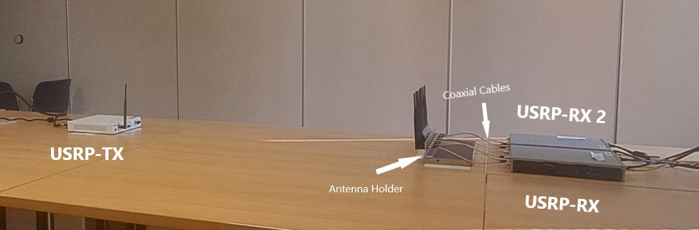
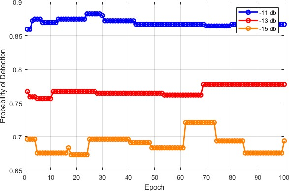
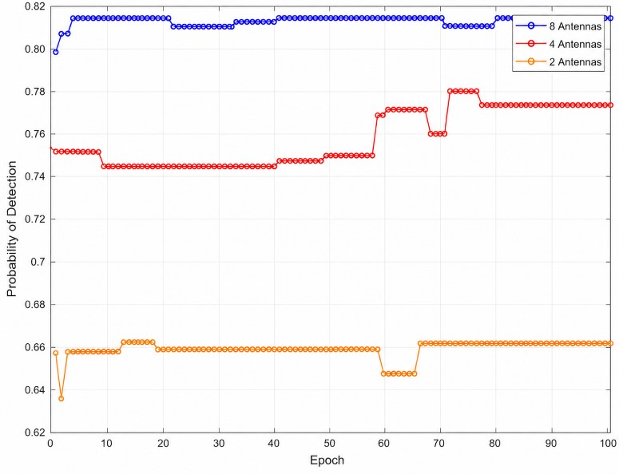

# AI-Based Spectrum Sensing Using SDRs and Artificial Neural Networks

## Overview

Efficient spectrum utilization is one of the major challenges in modern wireless communications. Traditional spectrum sensing methods often struggle in low Signal-to-Noise Ratio (SNR) environments and require carefully tuned detection thresholds.

This project investigates the use of Artificial Neural Networks (ANNs) to improve spectrum sensing performance in Cognitive Radio systems. Unlike many research works that rely solely on simulations, this study was experimentally validated using a real Software Defined Radio (SDR) platform composed of synchronized USRP receivers.

Developed during my Master 2 research internship at Gustave Eiffel University, the project combines machine learning, signal processing, and wireless communications to detect primary user activity under challenging radio conditions.

---

## Main Contributions

* Designed and evaluated an ANN-based spectrum sensing framework.
* Built a real-world experimental platform using USRP SDR devices.
* Implemented feature extraction based on Covariance Absolute Value (CAV) and Logarithmic Determinant (LogDet).
* Investigated the impact of multiple synchronized antennas on detection performance.
* Evaluated system performance using real RF measurements rather than simulated datasets.

---

## Experimental Platform

The hardware platform consists of:

* 2 × USRP N310 Software Defined Radios
* Up to 8 synchronized receiving antennas
* LTE signal generator
* GPS/OCTOCLOCK synchronization system
* MATLAB processing environment

The multi-receiver architecture was designed to improve signal detection performance in low-SNR scenarios through spatial diversity.

---

## Methodology

Received RF signals are processed to extract two sensing features:

* Covariance Absolute Value (CAV)
* Logarithmic Determinant (LogDet)

These features are used as inputs to a feed-forward Artificial Neural Network trained to classify:

* H0: Noise only
* H1: Primary User present

The model was trained and evaluated using experimentally collected datasets from the SDR platform.

---

## Results

The primary objective of this work was to evaluate the effectiveness of Artificial Neural Networks (ANNs) for spectrum sensing under challenging low-SNR conditions. The proposed framework achieved probabilities of detection of **88.6% at -11 dB**, **80.9% at -13 dB**, and **63.3% at -15 dB**, demonstrating reliable performance even in highly noisy environments.

### Detection Performance Across Different SNR Levels



In addition to the ANN evaluation, the impact of receiver diversity was investigated using **2, 4, and 8 synchronized antennas**. At **-15 dB**, the probability of detection improved from approximately **64% with 2 antennas** to **77% with 4 antennas**, reaching approximately **81% with 8 antennas**.

### Impact of Receiver Diversity



These results demonstrate that combining machine learning with synchronized multi-receiver SDR architectures can significantly enhance spectrum sensing reliability in challenging wireless environments.

---

## Technologies

* MATLAB
* Artificial Neural Networks (ANN)
* Software Defined Radio (SDR)
* USRP N310
* Signal Processing
* Cognitive Radio
* MIMO Systems
* Machine Learning

---

## Repository Contents

```text
├── Figures/
│   ├── System_architecture.jpg
│   ├── Detection_vs_snr.jpg
│   └── Detection_vs_antennas.jpg
├── Internship_Report.pdf
└── README.md
---
## Documentation

The complete internship report is available in:

`Internship_Report.pdf`

The report provides detailed information regarding the experimental platform, feature extraction process, ANN architecture, methodology, and performance evaluation.

---

## Author

**Alhadi Alhaidary**

Master 2 Health & Artificial Intelligence

Research Internship – LEOST Laboratory, Gustave Eiffel University
